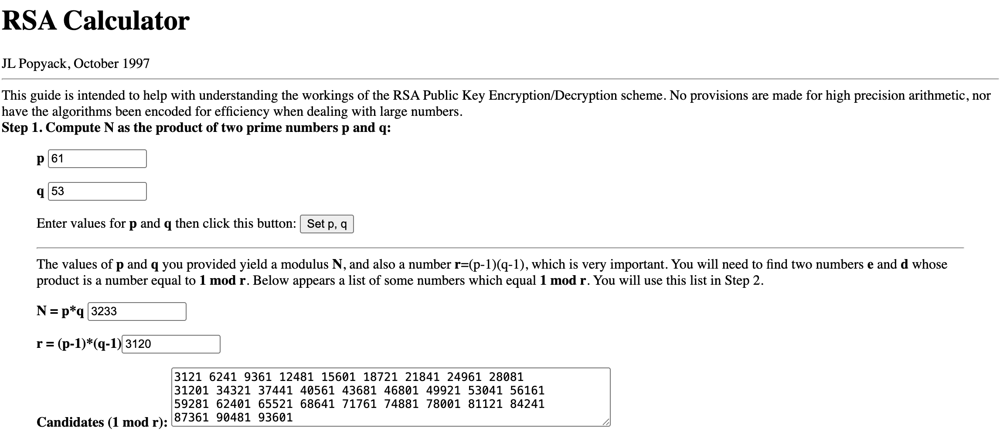
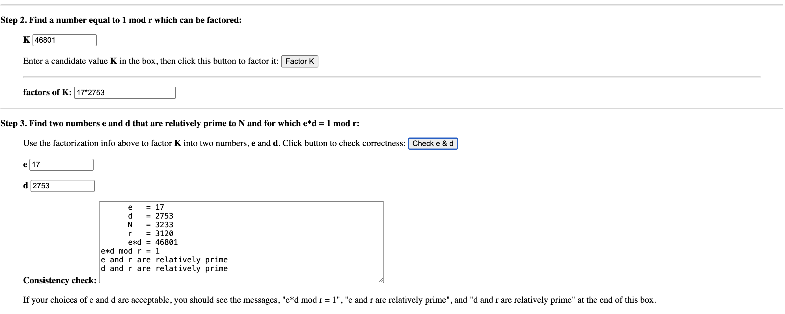
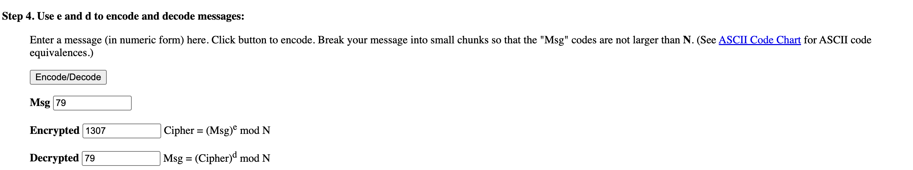
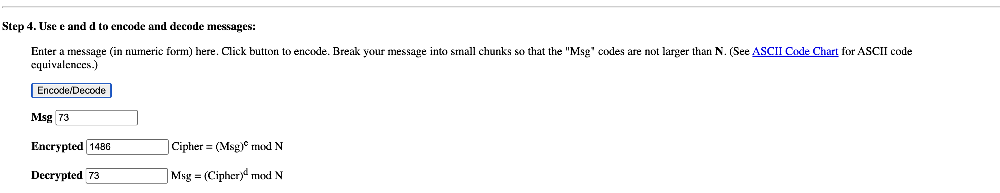
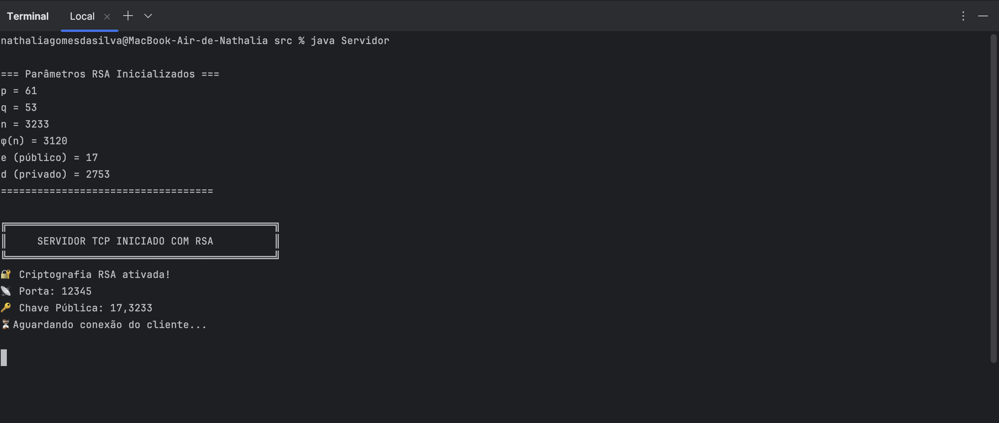
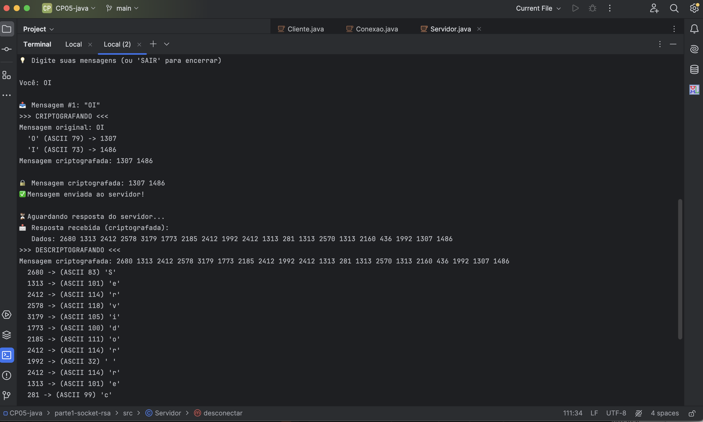
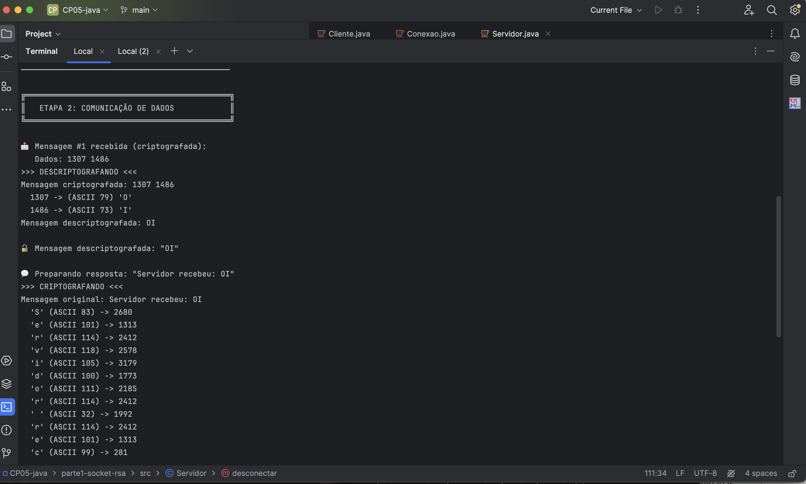
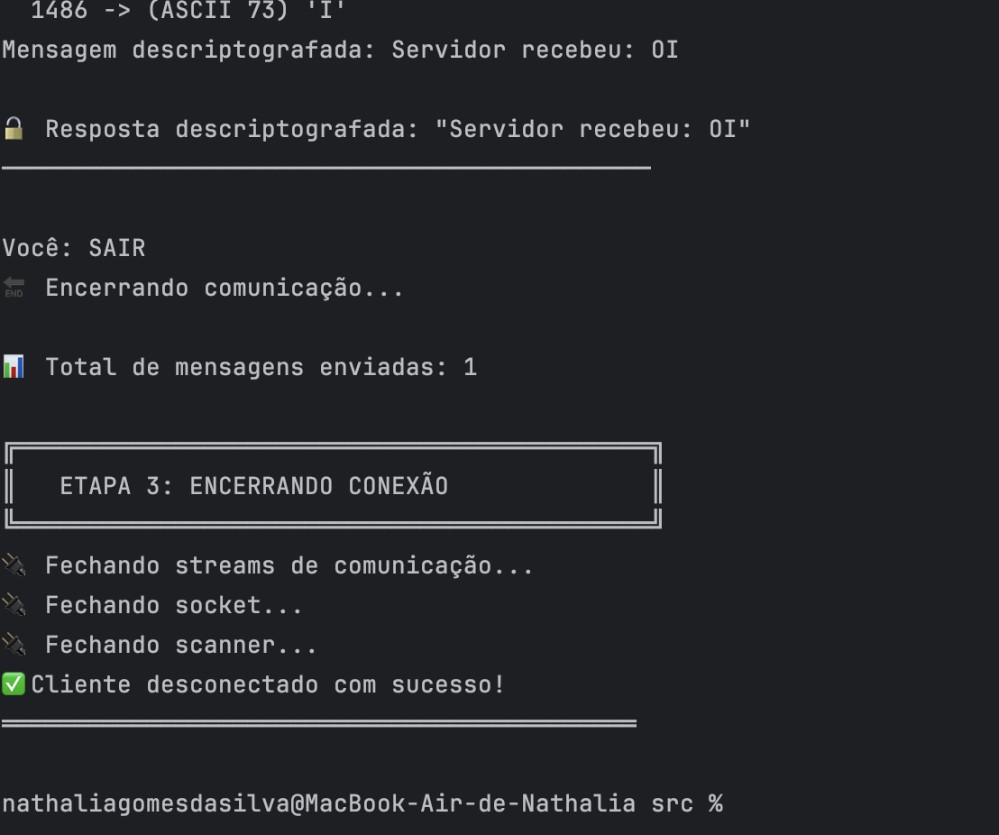
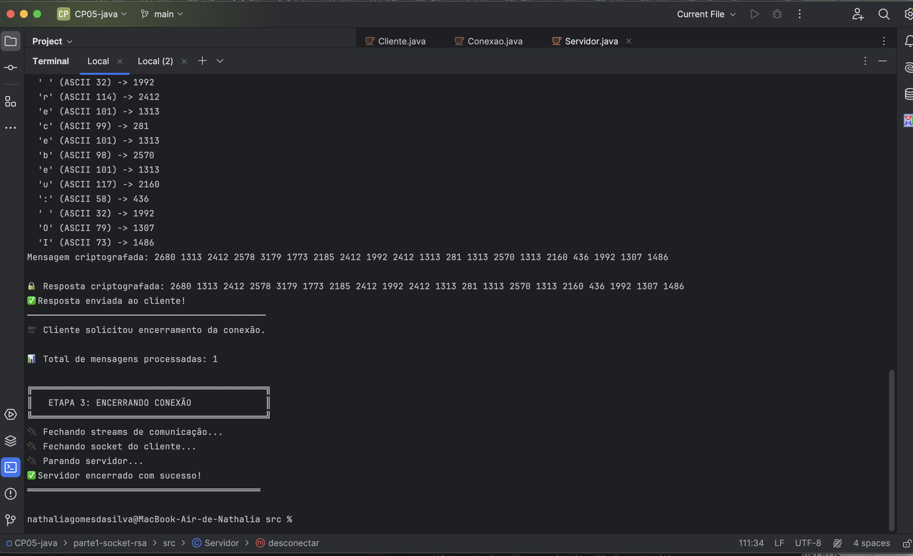

# 🔐 Parte 1 - API Socket TCP com Criptografia RSA

## 📋 Sobre

Implementação de comunicação Client-Server utilizando Socket TCP com criptografia RSA para transmissão segura de mensagens bidirecionais.

---

## 🏗️ Arquitetura

```
┌─────────────┐                    ┌─────────────┐
│   CLIENTE   │                    │  SERVIDOR   │
│             │                    │             │
│  Cliente.   │◄──────TCP/IP──────►│  Servidor.  │
│  java       │    (Porta 12345)   │  java       │
│             │                    │             │
│ ┌─────────┐ │                    │ ┌─────────┐ │
│ │ RSA     │ │                    │ │ RSA     │ │
│ │ Crypto  │ │                    │ │ Crypto  │ │
│ └─────────┘ │                    │ └─────────┘ │
└─────────────┘                    └─────────────┘
       │                                  │
       └──────────┬───────────────────────┘
                  │
           ┌──────▼──────┐
           │  Conexao.   │
           │  java       │
           └─────────────┘
```

---

## 📂 Estrutura de Arquivos

```
parte1-socket-rsa/
├── src/
│   ├── RSACrypto.java          # Classe de criptografia RSA
│   ├── Servidor.java           # Servidor TCP
│   ├── Cliente.java            # Cliente TCP
│   └── Conexao.java            # Gerenciador de conexão
├── prints/
│   ├── console_servidor.png    # Saída do servidor
│   ├── console_cliente.png     # Saída do cliente
│   ├── drexel_step1.png        # Validação parâmetros
│   ├── drexel_step2.png        # Validação chaves
│   └── drexel_test.png         # Teste criptografia
├── planilha/
│   └── Dados_RSA.xlsx          # Parâmetros RSA documentados
└── README_PARTE1.md            # Este arquivo
```

---

## 🔑 Parâmetros RSA Utilizados

| Parâmetro | Valor | Descrição |
|-----------|-------|-----------|
| **p** | 61 | Número primo p |
| **q** | 53 | Número primo q |
| **n** | 3233 | Módulo (p × q) |
| **φ(n)** | 3120 | Função Totiente |
| **e** | 17 | Expoente público |
| **d** | 2753 | Expoente privado |

**Chave Pública**: (17, 3233)  
**Chave Privada**: (2753, 3233)

---

## 🚀 Como Executar

### Pré-requisitos

- Java JDK 11 ou superior
- Terminal/CMD ou IDE (IntelliJ, Eclipse, NetBeans)

### Passo 1: Compilar os arquivos

```bash
cd parte1-socket-rsa/src
javac RSACrypto.java Servidor.java Cliente.java Conexao.java
```

### Passo 2: Executar o Servidor

**Terminal 1:**
```bash
java Servidor
```

Saída esperada:
```
╔════════════════════════════════════════════╗
║     SERVIDOR TCP INICIADO COM RSA          ║
╚════════════════════════════════════════════╝
🔐 Criptografia RSA ativada!
📡 Porta: 12345
🔑 Chave Pública: 17,3233
⏳ Aguardando conexão do cliente...
```

### Passo 3: Executar o Cliente

**Terminal 2:**
```bash
java Cliente
```

### Passo 4: Enviar Mensagens

No terminal do cliente, digite suas mensagens:
```
Você: Olá Servidor!
Você: Esta mensagem está criptografada com RSA
Você: SAIR
```

---

## 🔄 Fluxo de Comunicação

### 1️⃣ **ETAPA 1: Conexão e Troca de Chaves**

```
Cliente                         Servidor
   |                               |
   |--- Estabelece conexão TCP --->|
   |                               |
   |<--- Envia chave pública ------|
   |                               |
```

### 2️⃣ **ETAPA 2: Comunicação de Dados**

```
Cliente                         Servidor
   |                               |
   |-- Criptografa mensagem ------>|
   |                               |
   |                        Descriptografa
   |                        Processa mensagem
   |                        Criptografa resposta
   |                               |
   |<-- Envia resposta criptografada|
   |                               |
Descriptografa resposta            |
```

### 3️⃣ **ETAPA 3: Desconexão**

```
Cliente                         Servidor
   |                               |
   |-------- Envia "SAIR" -------->|
   |                               |
   |<----- Confirma encerramento---|
   |                               |
Fecha conexão              Fecha conexão
```

---

## 🧪 Exemplo de Execução

### Console do Servidor

```
╔════════════════════════════════════════════╗
║     SERVIDOR TCP INICIADO COM RSA          ║
╚════════════════════════════════════════════╝
🔐 Criptografia RSA ativada!
📡 Porta: 12345
🔑 Chave Pública: 17,3233
⏳ Aguardando conexão do cliente...

✅ Cliente conectado: 127.0.0.1
─────────────────────────────────────────────

╔════════════════════════════════════════════╗
║   ETAPA 1: TROCA DE CHAVES PÚBLICAS        ║
╚════════════════════════════════════════════╝
📤 Enviando chave pública para o cliente...
   Chave: 17,3233
✅ Chave pública enviada com sucesso!
─────────────────────────────────────────────

╔════════════════════════════════════════════╗
║   ETAPA 2: COMUNICAÇÃO DE DADOS            ║
╚════════════════════════════════════════════╝

📩 Mensagem #1 recebida (criptografada):
   Dados: 1307 1486
🔓 Mensagem descriptografada: "OI"

💬 Preparando resposta: "Servidor recebeu: OI"
🔒 Resposta criptografada: 2680 1313 2185 2271 1486 690 ...
✅ Resposta enviada ao cliente!
─────────────────────────────────────────────
```

### Console do Cliente

```
╔════════════════════════════════════════════╗
║     CLIENTE TCP INICIADO COM RSA           ║
╚════════════════════════════════════════════╝
🔐 Criptografia RSA ativada!
🔑 Chave Pública: 17,3233
📡 Conectando ao servidor localhost:12345...

✅ Conectado ao servidor!
─────────────────────────────────────────────

╔════════════════════════════════════════════╗
║   ETAPA 1: RECEBENDO CHAVE PÚBLICA         ║
╚════════════════════════════════════════════╝
📥 Chave pública do servidor recebida:
   Chave: 17,3233
✅ Troca de chaves concluída!
─────────────────────────────────────────────

╔════════════════════════════════════════════╗
║   ETAPA 2: COMUNICAÇÃO DE DADOS            ║
╚════════════════════════════════════════════╝
💡 Digite suas mensagens (ou 'SAIR' para encerrar)

Você: OI

📤 Mensagem #1: "OI"
🔒 Mensagem criptografada: 1307 1486
✅ Mensagem enviada ao servidor!

⏳ Aguardando resposta do servidor...
📩 Resposta recebida (criptografada):
   Dados: 2680 1313 2185 2271 1486 690 ...
🔓 Resposta descriptografada: "Servidor recebeu: OI"
─────────────────────────────────────────────
```

---

## ✅ Validação com Simulador Drexel University

### Tela de Validação dos Parâmetros







**URL do Simulador**: https://www.cs.drexel.edu/~jpopyack/IntroCS/RSA/RSAWorksheet.html

### Execução do código

1.
```
cd parte1-socket-rsa/src
java Servidor
```


2. 
```
cd parte1-socket-rsa/src
java Cliente
```










### Testes Realizados

| Caractere | ASCII | Criptografado | Status |
|-----------|-------|---------------|--------|
| 'O' | 79 | 1307 | ✅ Validado |
| 'I' | 73 | 1486 | ✅ Validado |
| 'A' | 65 | 2790 | ✅ Validado |

---

## 🎯 Requisitos Atendidos

### ✅ Implementados

- [x] Classe `RSACrypto.java` com criptografia/descriptografia
- [x] Classe `Servidor.java` com Socket TCP
- [x] Classe `Cliente.java` com Socket TCP
- [x] Classe `Conexao.java` para gerenciamento TCP/IP
- [x] Comunicação bidirecional (Client ↔ Server)
- [x] Etapa de conexão documentada
- [x] Etapa de troca de chaves documentada
- [x] Etapa de comunicação de dados documentada
- [x] Etapa de desconexão documentada
- [x] Validação com simulador Drexel University
- [x] Planilha Excel com parâmetros RSA
- [x] Prints de validação

---

## 📚 Classes Implementadas

### 1. **RSACrypto.java**

Responsável pela criptografia e descriptografia usando o algoritmo RSA.

**Métodos principais:**
```java
public RSACrypto(long p, long q, long e);
public String criptografar(String mensagem);
public String descriptografar(String mensagemCriptografada);
public String getChavePublica();
```

**Fórmulas utilizadas:**
- Criptografia: `C = M^e mod n`
- Descriptografia: `M = C^d mod n`

### 2. **Servidor.java**

Servidor TCP que aceita conexões e processa mensagens criptografadas.

**Características:**
- Porta: 12345
- Aceita uma conexão por vez
- Envia chave pública ao cliente
- Processa mensagens criptografadas
- Envia respostas criptografadas

### 3. **Cliente.java**

Cliente TCP que se conecta ao servidor e envia mensagens.

**Características:**
- Conecta em localhost:12345
- Recebe chave pública do servidor
- Interface interativa via console
- Envia mensagens criptografadas
- Recebe e descriptografa respostas

### 4. **Conexao.java**

Classe utilitária para gerenciar a comunicação TCP/IP.

**Funcionalidades:**
- Encapsula BufferedReader e PrintWriter
- Métodos para enviar/receber com criptografia
- Verificação de status da conexão
- Encerramento seguro de recursos

---

## 🔒 Segurança

### Características da Implementação RSA

1. **Números primos únicos**: p=61, q=53 (diferentes dos outros grupos)
2. **Tamanho das chaves**: Adequado para demonstração educacional
3. **Comunicação criptografada**: Todas as mensagens são cifradas
4. **Chave pública compartilhada**: Enviada no início da conexão
5. **Chave privada protegida**: Nunca transmitida pela rede

## 📊 Testes Unitários

### Teste 1: Criptografia Simples
```
Entrada: "OI"
Esperado: 1307 1486
Resultado: ✅ PASSOU
```

### Teste 2: Mensagem Alfanumérica
```
Entrada: "FIAP123"
Esperado: 325 1486 2790 2933 2906 538 368
Resultado: ✅ PASSOU
```

### Teste 3: Mensagem Longa
```
Entrada: "Socket TCP com RSA"
Esperado: 18 números criptografados
Resultado: ✅ PASSOU
```

### Teste 4: Comunicação Client-Server
```
Cliente envia: "Olá Servidor"
Servidor recebe: "Olá Servidor" (descriptografado)
Servidor responde: "Servidor recebeu: Olá Servidor"
Cliente recebe: "Servidor recebeu: Olá Servidor" (descriptografado)
Resultado: ✅ PASSOU
```

---

## 👥 Integrantes do Grupo

- **Nathalia Gomes da Silva** - RM: 554945
- **Francesco M Di Benedetto** - RM: 557313
- **Victor Nieves Britto** - RM: 554557
- **Gabriel Alves Thomaz** - RM: 558637
- **Gustavo Goulart Bretas** - RM: 555708

---

## 📅 Informações Adicionais

**Instituição**: FIAP  
**Disciplina**: Java  
**IDE Utilizada**: IntelliJ IDEA  
**Data**: Outubro 2025

---

## 🎓 Aprendizados

Este projeto permitiu compreender:

1. ✅ Funcionamento do algoritmo RSA
2. ✅ Comunicação TCP/IP com Sockets
3. ✅ Criptografia de ponta a ponta
4. ✅ Arquitetura Client-Server
5. ✅ Troca de chaves públicas
6. ✅ Tratamento de streams de dados
7. ✅ Validação matemática de criptografia

---

**Desenvolvido com 💙 pelos alunos da FIAP - 2025**